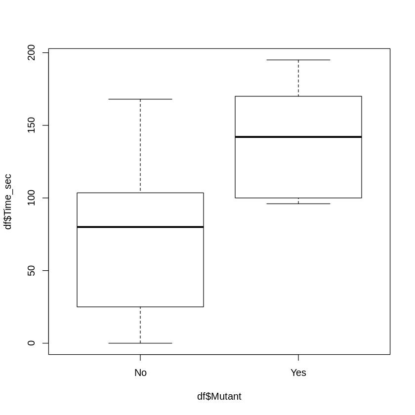

# Behavioral Bioinformatics Analytics with Uncertainty Estimation

Data science workflow for behavioral and ecological response analysis under sampling uncertainty.

## Overview

Analyzes zebrafish aggression scores and beetle counts using R. The project combines boxplots, histograms, summary statistics, standard errors, and confidence intervals to compare biological groups and quantify uncertainty in small-sample biological data.

The project is framed as a data science estimation problem: summarize noisy biological observations, compare group behavior, and communicate uncertainty before making conclusions.

## Tools and Methods

- R
- Boxplots
- Histograms
- Mean and standard deviation
- Standard error
- Confidence intervals
- Small-sample inference
- Group comparison
- Uncertainty quantification

## Key Work

- Compared aggression timing between wild-type and mutant zebrafish.
- Estimated beetle abundance with measures of spread and uncertainty.
- Translated statistical output into concise biological conclusions.
- Treated genotype/status as a predictor variable and behavioral response time as the outcome variable.
- Used confidence intervals to show the reliability of sample-based estimates.

## Data Science Framing

- **Problem type:** Biological group comparison and estimation.
- **Features:** Mutant status/genotype and sampling night.
- **Response variables:** Aggression time and beetle count.
- **Modeling extension:** This could be extended into linear modeling or bootstrap resampling to estimate uncertainty more robustly.

## Dataset

Small biological datasets entered directly in the notebook.

## Files

- `analysis.ipynb`: Main analysis notebook copied from the original Colab notebook.
- `assets/`: Extracted figures from the notebook for GitHub previews and README visuals.

## Resume Summary

Analyzed zebrafish aggression and beetle count data in R using group comparison, uncertainty estimates, boxplots, histograms, standard errors, and confidence intervals.
